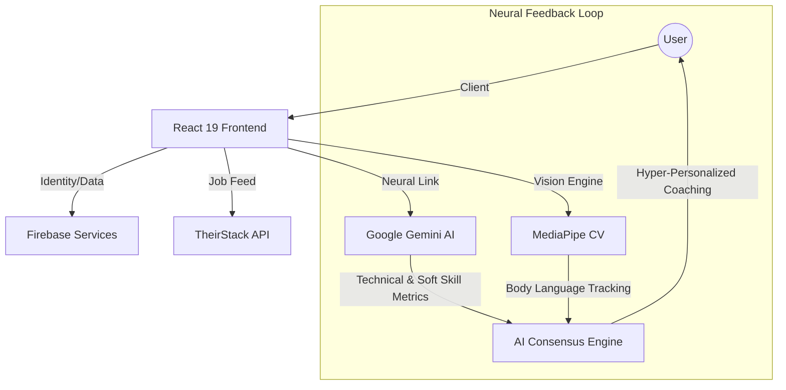

# 🚀 HireME: AI-Enhanced Neural Career Pathway

[](https://vitejs.dev/)
[](https://react.dev/)
[](https://firebase.google.com/)
[](https://ai.google.dev/)

**HireME** is a high-fidelity, AI-driven recruitment ecosystem designed to bridge the gap between candidate potential and global industry demand. Built with a "Neural First" philosophy, it combines real-time computer vision, large language models (LLMs), and high-prestige UI to provide a board-ready career preparation lifecycle.

---

## 🔭 Vision & Evolution

In the modern hiring landscape, resumes are static and interviews are high-pressure black boxes. **HireME** transforms this by introducing a **Neural Resonance** layer—a continuous, high-fidelity feedback loop where your movements, vocal tone, and technical achievements are analyzed in real-time. We don't just prepare you for a job; we align your unique neural profile with the world's most innovative career nodes.

---

## 🛰 System Architecture & The Neural Link



---

## 🧠 Technical Deep-Dive & Module Breakdown

### 🔍 1. Automated Neural Resume Optimization
> **From Raw Experience to Board-Ready Professionalism**.

Our **Automated Resume Enhancer** does not merely swap words; it performs a multi-stage semantic transformation:
*   **Semantic Impact Scan**: The `gemini-3-flash-preview` core performs a 0.2s scan of your resume text, identifying low-impact verbs and non-quantifiable achievements.
*   **STAR-Bullet Synthesis**: The system automatically refactors every bullet point using the **S**ituation, **T**ask, **A**ction, and **R**esult framework. It proactively suggests metrics based on industry benchmarks for your specific role.
*   **One-Click Neural Enhancement**: A specialized "Neural Profile" model re-architects your entire layout into a premium, board-ready professional template. This isn't just a style change; it's a semantic restructuring focused on **impact density** and token-efficient readability.
*   **Keyword Resonance Checklist**: HireME cross-references your resume with modern job requirements to provide a real-time "Missing Nodes" list, allowing you to bridge technical skill gaps before you apply.

### 🎭 2. AI Interview Suite: The Coach in the Machine
> **High-Fidelity Computer Vision & Recursive LLM Orchestration**.

The **Practice Interview** module is a breakthrough in client-side AI, performing localized computer vision analysis at 60+ FPS.

#### **MediaPipe Vision Engine**
Integrating **MediaPipe Holistic** (Face Mesh, Hands, and Pose), HireME tracks:
*   **Eye Contact Resonance**: Tracks the iris and eyelid landmarks to calculate constant "Engagement Score" with the camera.
*   **Gestural Fluidity**: Distinguishes between confident hand gestures and nervous/repetitive movements.
*   **Body Posture Tracking**: Detects slouching or energy shifts in real-time, providing immediate haptic or visual feedback.
*   **Privacy-First CV**: All landmark processing occurs on the client, ensuring your camera feed is never transmitted to a server.

#### **Recursive Gemini Brain**
*   **Adaptive Follow-Ups**: The AI interviewer uses a recursive context window to ask detailed follow-up questions based *specifically* on your previous answer, simulating the pressure of a live expert interview.
*   **Persona Calibration**: The interviewer shifts its tone and difficulty (from "Empathetic Coach" to "Rigorous Architect") based on your performance level.
*   **Consolidated Feedback**: Provides a multi-dimensional performance report covering technical accuracy, vocal resonance, and confidence metrics.

### 🔍 3. Hyper-Personalized Neural Job Feed
> **The Resonance Link between Practice and Placement**.

The core differentiator of HireME is its **Resonance matching** algorithm. 
*   **Neural Profile Linkage**: Your performance metrics from the Interview Suite are combined with your Resume data to create a "Consolidated Neural Profile".
*   **Job Node Mapping**: Using the **TheirStack API**, the system maps your unique profile to 10M+ real-time job nodes. It doesn't just look for titles; it looks for **cultural and technical resonance**.
*   **Hyper-Personalization**: 
    *   If you excel at technical architecture but struggle with soft-skill delivery, the system might suggest roles that prioritize deep engineering.
    *   It provides a "Reason for Resonance" for every recommendation (e.g., "Your STAR-compliant explanation of Bloom Filters matches the technical rigour of this Backend Arch role").
*   **Node Persistence**: Save and track your career nodes in a localized Firestore environment, synchronized across all your devices.

---

## 🛠 Tech Stack: A High-Fidelity Foundation

### **Frontend & UI Core**
- **React 19 & Vite 8**: Delivering ultra-fast hydration and high-performance routing.
- **TypeScript**: Ensuring type-safe neural data processing through the entire application cycle.
- **Framer Motion 12**: Luxurious micro-animations that make the interface feel alive.
- **Tailwind CSS 4**: Next-gen styling with 0-runtime overhead, optimized for our signature "HireME Blue" aesthetic.

### **AI & Machine Learning Infrastructure**
- **Model Orchestration**: Dual-model strategy using `gemini-3-flash-preview` for complex reasoning and `gemini-2.5-flash` for high-reliability fallbacks.
- **Computer Vision (CV)**: **MediaPipe** for real-time, 60+ FPS client-side body language tracking.
- **Data Visualization**: **Recharts** for visualizing performance trends and resonance growth.

### **Services & Security**
- **Firebase Firestore**: Real-time persistence for your career pathway and saved nodes.
- **Firebase Auth**: Secure, seamless Google and Email identity management.
- **Zero-Trust Video**: No camera data is ever stored; analysis is performed entirely in RAM and discarded instantly.

---

## 👥 The Neural Team

| Name | Role | Core Responsibility |
| :--- | :--- | :--- |
| **Arron** | Lead Developer | Neural Architecture & Business Strategy |
| **Reshley** | Narrative Lead | Product Storytelling & Pitch Manuscript |
| **Gion** | Technical Editor | Video Production & Frontend UI Logic |
| **Alex** | AI Developer | LLM Orchestration & Backend Sync |
| **Masato** | Pitch Specialist | Market Delivery & Growth Positioning |

---

## 🚀 Installation & Neural Setup

1. **Clone the matrix**:
   ```bash
   git clone https://github.com/darknecrocities/HireME.git
   cd HireME
   ```
2. **Initialize Node Modules**:
   ```bash
   npm install
   ```
3. **Environment Calibration**:
   Create a `.env` file from the example:
   ```env
   VITE_FIREBASE_API_KEY=your_key
   VITE_GEMINI_API_KEY=your_key
   VITE_THEIRSTACK_API_KEY=your_key
   ```
4. **Ignite the Engine**:
   ```bash
   npm run dev
   ```

---

*Engineered with precision for the next generation of professionals. ✨ 2026 TAIM TEAM*
