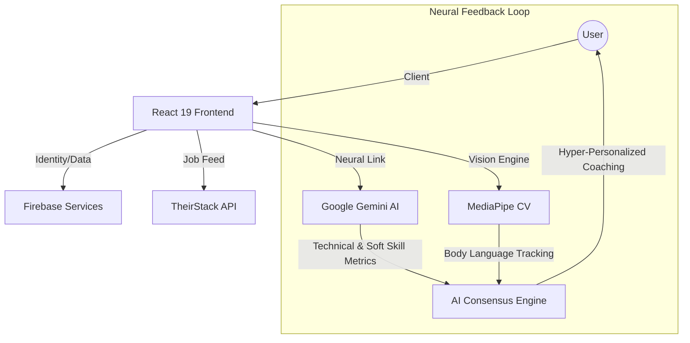

# 🚀 HireME: AI-Enhanced Neural Career Pathway

[](https://vitejs.dev/)
[](https://react.dev/)
[](https://firebase.google.com/)
[](https://ai.google.dev/)

**HireME** is a high-fidelity, AI-driven recruitment ecosystem designed to bridge the gap between candidate potential and global industry demand. Built with a "Neural First" philosophy, it combines real-time computer vision, large language models (LLMs), and high-prestige UI to provide a board-ready career preparation lifecycle.

---

## 🔭 Vision & Evolution

In the modern hiring landscape, resumes are static and interviews are high-pressure black boxes. **HireME** transforms this by introducing a **Neural Resonance** layer—a continuous, high-fidelity feedback loop where your movements, vocal tone, and technical achievements are analyzed in real-time. We don't just prepare you for a job; we align your unique neural profile with the world's most innovative career nodes.

---

## 🛰 System Architecture & The Neural Link



---

## 🧠 Technical Deep-Dive: The HireME Engine

### 🔍 Automated Neural Resume Enhancement
> **The Transformation Pipeline**: From Raw Experience to Board-Ready Professionalism.

Our **Automated Resume Enhancer** does not merely swap words; it performs a multi-stage semantic transformation:
1.  **Extraction & Parsing**: Using `pdf.js-dist` to extract high-fidelity text from user-uploaded PDFs, preserving structure and context.
2.  **Semantic Analysis**: The `gemini-3-flash-preview` core analyzes the text for *impact density*. It identifies where the user has described "tasks" rather than "achievements".
3.  **STAR-Bullet Synthesis**: The engine automatically refactors bullet points into the **S**ituation, **T**ask, **A**ction, and **R**esult (STAR) framework. It proactively suggests quantitative metrics (e.g., "Increased revenue by 25%") based on the context of the role.
4.  **Formalized Formatting**: The final output is an **EnhancedResume** object, structured for board-ready presentation. This includes a professional summary, categorized skill nodes, and chronologically optimized experience blocks.
5.  **One-Click Neural Export**: Using `jsPDF`, the system generates a formalized, clean, and ATS-friendly PDF that matches the high-prestige aesthetic of the HireME platform.

### 🎭 AI Interview Suite: The Coach in the Machine
> **MediaPipe Computer Vision & Gemini LLM Orchestration**.

The **Practice Interview** module is a breakthrough in client-side AI performance, utilizing a dual-engine approach to behavioral and technical coaching.

#### **I. MediaPipe Vision Architecture**
HireME integrates the **MediaPipe Holistic Ecosystem** (Face Mesh, Hands, and Pose) to track 468+ facial landmarks and full-body posture:
*   **Eye Contact Resonance**: By tracking the iris and eyelid landmarks, the system calculates the frequency and duration of eye contact with the camera, alerting the user to "camera engagement" levels.
*   **Gestural Dynamics**: Using hand landmark tracking, the system differentiates between "open/confident" gestures and "nervous/constricted" movements.
*   **Body Posture Tracking**: Pose detection ensures the candidate maintains an upright, authoritative posture, providing a live "Professional Presence" score.
*   **0-Latency Processing**: All CV processing happens on the client-side, ensuring data privacy and a responsive UI experience at 30+ FPS.

#### **II. High-Fidelity Gemini Brain**
The interview logic is powered by **Google Gemini API**, utilizing a recursive prompt engineering strategy:
*   **Recursive Context Windows**: The AI doesn't just ask static questions. It follows up on the candidate's last answer, probing for deeper technical detail or "S.T.A.R" clarity.
*   **Dynamic Role-Playing**: Based on the target role (e.g., "Senior Blockchain Architect"), the AI shifts its persona—adjusting its vocabulary, pressure levels, and technical depth.
*   **Consolidated Neural Analysis**: Post-session, the Gemini engine analyzes the full transcript alongside the MediaPipe metrics to provide a multi-dimensional performance report.

### 🔍 Hyper-Personalized Neural Job Feed
> **Bridging Practice and Placement**.

HireME closes the loop by mapping your practice data to real-world opportunities:
*   **Neural Resonance Matching**: The system cross-references your soft-skill scores (compiled from MediaPipe) and technical scores (compiled from Gemini) with live job nodes.
*   **The Resume-Job Resonance**: It analyzes your latest resume against the current job market to find roles with the highest "profile resonance".
*   **TheirStack API Integration**: Access to 10M+ job nodes through a high-concurrency search panel, providing real-time data on remote availability, tech stacks, and company culture.

---

## 🛠 Tech Stack: A High-Fidelity Foundation

### **Frontend & UI Core**
- **React 19 & Vite 8**: The cutting edge of modern web performance, delivering sub-200ms hydration and ultra-fast transitions.
- **TypeScript**: Ensuring type-safe neural data processing through every component.
- **Framer Motion 12**: Luxurious micro-animations that make the interface feel alive and responsive.
- **Tailwind CSS 4**: Next-gen utility-first styling with zero runtime overhead, optimized for the "HireME Blue" glassmorphic aesthetic.

### **AI & Machine Learning Infrastructure**
- **Model Orchestration**: Dual-model strategy using `gemini-3-flash-preview` for complex reasoning and `gemini-1.5-flash` for high-availability fallbacks.
- **Computer Vision (CV)**: MediaPipe for real-time, client-side body language and landmark tracking.
- **Data Visualization**: `Recharts` for visualizing performance trends and "Neural Resonance" growth.

### **Services & Security**
- **Firebase Firestore**: Real-time persistence for your career pathway and saved nodes.
- **Firebase Auth**: Secure, seamless Google and Email identity management.
- **Privacy-First Processing**: Sensitive document text and vision analysis remain on the client, ensuring maximum data sovereignty.

---

## 👥 The Neural Team

| Name | Role & Strategic Responsibility | Core Technical Focus |
| :--- | :--- | :--- |
| **Arron** | Lead Developer & Pitch Architect | High-Fidelity Infrastructure & Strategy |
| **Reshley** | Narrative Lead | Product Storytelling & Pitch Manuscript |
| **Gion** | Technical Producer | Video Production & Frontend UI Logic |
| **Alex** | AI Engineering Specialist | LLM Orchestration & Backend Sync |
| **Masato** | Pitch Specialist | Market Delivery & Growth Positioning |

---

## 🚀 Installation & Neural Setup

1. **Clone the Node**:
   ```bash
   git clone https://github.com/darknecrocities/HireME.git
   cd HireME
   ```

2. **Initialize Dependencies**:
   ```bash
   npm install
   ```

3. **Configure Neural Links**:
   Create a `.env` file in the project root:
   ```env
   VITE_FIREBASE_API_KEY=your_key
   VITE_GEMINI_API_KEY=your_key
   ```

4. **Launch Application**:
   ```bash
   npm run dev
   # Access your path at http://localhost:5173
   ```

---

*Built with ❤️ for the future of digital hiring. Pioneer your Pathway with HireME.*
