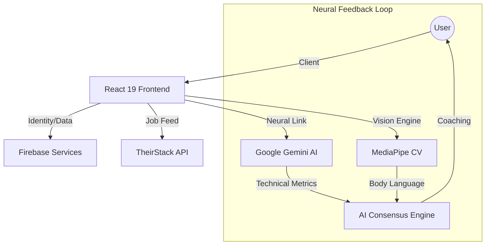

# 🚀 HireME: AI-Enhanced Neural Career Pathway

[](https://vitejs.dev/)
[](https://react.dev/)
[](https://firebase.google.com/)
[](https://ai.google.dev/)

**HireME** is a premium, AI-driven recruitment suite designed to bridge the gap between candidate potential and industry demand. Built with a "Neural First" philosophy, it combines real-time computer vision, large language models, and high-fidelity UI to provide a board-ready career preparation experience.

---

## 🔭 Vision & Evolution

The traditional recruitment process is fragmented and static. **HireME** evolves this by introducing a **Neural Resonance** layer—a continuous feedback loop where your movements, vocal tone, and professional achievements are analyzed in real-time to match you with high-growth career nodes.

---

## 🛰 System Architecture



---

## ✨ Features Deep-Dive

### 🧠 Neural Resume Optimization
*   **Semantic Scoring**: Beyond simple keywords; our engine understands the *impact* of your achievements.
*   **STAR-Method Alignment**: Automatically refactors bullet points to emphasize **S**ituation, **T**ask, **A**ction, and **R**esult.
*   **Neural Enhancement**: A specialized model re-architects your resume into a premium, board-ready template with a focus on token efficiency and readability.

### 🎭 High-Fidelity Practice Interviews
*   **A-Body Tracking**: Real-time analysis of eye contact, posture, and micro-gestures using MediaPipe Face Mesh and Pose.
*   **Vocal Resonance**: Analysis of vocal confidence and pacing.
*   **Contextual Drills**: Gemini-driven interviewers that adapt their questions based on your real-time responses and the specific job node you are targeting.

### 🔍 Search & Neural Recommendations
*   **Neural Job Feed**: Powered by Theirstack, providing deep metadata on roles, technologies, and salary ranges.
*   **Resonance Recommendation**: The system analyzes your interview performance and suggests roles where your soft and hard skills have the highest resonance.
*   **Path Persistence**: Save and track your career nodes in a synchronized Firestore environment.

---

## 🛠 Tech Stack

### High-Fidelity Frontend
- **React 19 & Vite 8**: The cutting edge of modern web performance.
- **TypeScript**: Ensuring type-safe neural data processing.
- **Framer Motion 12**: Luxurious micro-animations and smooth transitions.
- **Tailwind CSS 4**: Next-gen styling with 0-runtime overhead.

### AI & Neural Infrastructure
- **Model Orchestration**: `gemini-3-flash-preview` and `gemini-1.5-flash` with automatic failover.
- **Vision Engine**: MediaPipe for high-performance client-side body language tracking.
- **Data Visualization**: Recharts for visualizing interview performance metrics.

### Backend & Security
- **Firebase Firestore**: Real-time persistence for your career pathway.
- **Firebase Auth**: Secure, seamless identity management.
- **Client-Side Privacy**: All PDF processing and initial vision analysis occur on the client to ensure maximum data sovereignty.

---

## 👥 The Team

| Name | Role & Responsibility | Focus |
| :--- | :--- | :--- |
| **Arron** | Lead Developer & Pitch Architect | Core Architecture & Strategy |
| **Reshley** | Narrative Lead & Pitch Specialist | Manuscript & User Story |
| **Gion** | Technical Editor & Full Stack dev | Video Production & UI Logic |
| **Alex** | AI Integration Specialist | Backend & Neural Engineering |
| **Masato** | Pitch & Growth Strategist | Business Alignment & Delivery |

---

## 📁 Project Structure

```text
hireme/
├── src/
│   ├── components/      # Reusable Neural UI components
│   ├── hooks/           # AI & Data custom logic
│   ├── pages/           # High-fidelity view layouts
│   ├── services/        # Firebase & Gemini integrations
│   ├── types/           # Global type definitions
│   └── utils/           # Helper functions for PDF/Text
├── public/              # Static assets and workers
└── README.md            # You are here
```

---

## 🚀 Installation & Neural Setup

1. **Clone & Install**:
   ```bash
   git clone https://github.com/darknecrocities/HireME.git
   npm install
   ```

2. **Environment Configuration**:
   Create a `.env` in the root and configure your neural links:
   ```env
   VITE_FIREBASE_API_KEY=your_key
   VITE_GEMINI_API_KEY=your_key
   ```

3. **Production Build**:
   ```bash
   npm run build
   # Verify high-performance bundle output
   ```

---

## 🗺 Roadmap

- [ ] **Multi-Session Trends**: Track your neural growth over multiple interviews.
- [ ] **Technical Assessment Sandbox**: Real-time coding challenges with AI peer review.
- [ ] **Global Pathway Sync**: Mobile application for career tracking on the go.

---

*Built with ❤️ by the HireME Team.*
